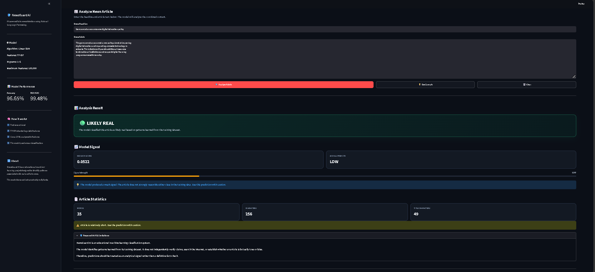
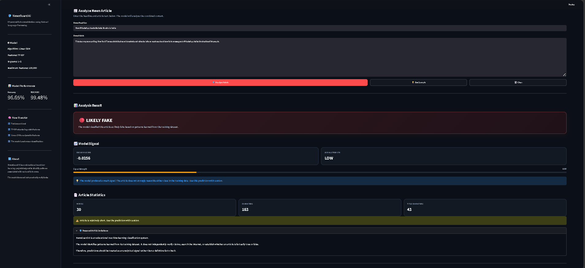

# 🛡️ NewsGuard AI

## AI-Powered Fake News Detection

NewsGuard AI is a machine-learning project that analyzes news articles and classifies them as **Likely Real** or **Likely Fake**.

The system uses **Natural Language Processing (NLP)**, **TF-IDF feature extraction**, and a **Linear Support Vector Machine (SVM)** to identify patterns learned from a labeled news dataset.

> ⚠️ **Important:** NewsGuard AI does not independently verify facts or determine the absolute truth of an article. Its output is a machine-learning classification based on patterns learned from the training data.

---

## 🖥️ Application Preview

### Main Interface


### 🟢 Real News Detection



### 🔴 Fake News Detection



NewsGuard AI provides an interactive Streamlit interface for
analyzing news articles and displaying the model's prediction,
decision score, signal strength, and article statistics.

---

## 🚀 Features

* 📰 News headline and article analysis
* 🤖 Machine-learning based classification
* 🔤 TF-IDF text feature extraction
* ⚡ Linear SVM classifier
* 📊 Decision score
* 📈 Signal strength
* 📄 Article statistics
* ⚠️ Short article warnings
* 🖥️ Interactive Streamlit web interface
* 🧪 Prediction testing
* 📊 Model evaluation and validation

---

## 🧠 How It Works

```text
News Headline + Article
          ↓
      Text Input
          ↓
   Combined Text
          ↓
     TF-IDF Vectorizer
          ↓
      Linear SVM
          ↓
    Decision Score
          ↓
     REAL / FAKE
```

The application combines the headline and article text before passing the content through the trained machine-learning pipeline.

---

## 🛠️ Tech Stack

| Technology   | Purpose                   |
| ------------ | ------------------------- |
| Python       | Core programming language |
| Streamlit    | Interactive web interface |
| Scikit-learn | Machine-learning pipeline |
| TF-IDF       | Text feature extraction   |
| Linear SVM   | News classification       |
| Pandas       | Dataset processing        |
| NumPy        | Numerical operations      |
| Joblib       | Model serialization       |
| Matplotlib   | Data visualization        |
| Seaborn      | Exploratory data analysis |

---

## 📊 Model Performance

The NewsGuard AI interface reports the following evaluation results:

| Metric   |      Score |
| -------- | ---------: |
| Accuracy | **96.65%** |
| ROC-AUC  | **99.48%** |

These results represent the model's performance on the evaluation performed during the project.

> ⚠️ High evaluation performance does not mean the system can independently determine whether a news article is factually true. The model learns patterns from its training data.

---

## 📁 Project Structure

```text
NEWSGUARD AI/
│
├── assets/
│   ├── article_word_count_distribution.png
│   ├── class_distribution.png
│   └── newsguard_ai_demo.png
│
├── src/
│   ├── analyze_errors.py
│   ├── baseline_model.py
│   ├── check_leakage.py
│   ├── clean_dataset.py
│   ├── data_quality.py
│   ├── duplicate_analysis.py
│   ├── eda.py
│   ├── inspect_dataset.py
│   ├── linear_svm.py
│   ├── naive_bayes.py
│   ├── predictor.py
│   ├── prepare_data.py
│   ├── test_predictor.py
│   ├── tfidf_logistic.py
│   ├── train_final.py
│   ├── tune_svm.py
│   └── validate_final_model.py
│
├── .gitignore
├── README.md
├── app.py
├── evaluate_model.py
├── predict.py
├── requirements.txt
└── train_model.py
```

> **Note:** Large datasets and trained model files are kept locally and excluded from the Git repository through `.gitignore`.

---

## ⚙️ Installation

### 1. Clone the repository

```bash
git clone https://github.com/pradumgoyal15/NewsGuard-AI.git
cd NewsGuard-AI
```

### 2. Create a virtual environment

```bash
python -m venv .venv
```

### 3. Activate the virtual environment

**Windows PowerShell:**

```powershell
.venv\Scripts\Activate.ps1
```

### 4. Install dependencies

```bash
pip install -r requirements.txt
```

---

## ▶️ Running the Application

Start the Streamlit application with:

```bash
streamlit run app.py
```

The application will open in your browser.

Enter a news headline and article, then select:

**🔍 Analyze Article**

The system will return:

* Likely Real / Likely Fake classification
* Decision score
* Signal strength
* Article statistics
* Warnings when the article is too short

---

## 🧪 Testing

The project includes prediction testing functionality.

Run:

```bash
python src/test_predictor.py
```

The prediction engine can also be tested directly through:

```bash
python predict.py
```

---

## 🔍 Model Pipeline

NewsGuard AI uses the following machine-learning pipeline:

```text
Raw News Text
     ↓
Text Preprocessing
     ↓
TF-IDF Vectorization
     ↓
Linear SVM Classifier
     ↓
Prediction
     ↓
REAL / FAKE
```

The prediction engine also calculates a **decision score** and categorizes the model signal as:

* 🟡 **LOW**
* 🔵 **MEDIUM**
* 🟢 **HIGH**

---

## ⚠️ Limitations

NewsGuard AI is a machine-learning classification system, not a professional fact-checking system.

The model:

* Does not independently verify claims.
* Does not search the internet for supporting evidence.
* Does not determine the absolute truth of an article.
* Can produce incorrect classifications.
* May be less reliable for very short articles.
* Reflects patterns present in its training data.

Therefore, predictions should be treated as an **analytical signal rather than a definitive fact-check**.

---

## 🎯 Project Purpose

NewsGuard AI was developed as an educational machine-learning project to explore:

* Natural Language Processing
* Text classification
* TF-IDF feature engineering
* Support Vector Machines
* Model evaluation
* Error analysis
* Streamlit application development
* Machine-learning project deployment

---

## 👨‍💻 Author

**Pradum Goyal**

B.Tech Computer Science Engineering Student

---

## 📌 Disclaimer

NewsGuard AI is intended for **educational and experimental purposes**.

A prediction from this system should not be used as the sole basis for determining whether a real-world news article is true or false.
